Enemy Sprite Catalog
====================

This catalog renders every SMB3 enemy/item definition in Foundry's enemy object set.
It is generated from ``data/objects.dat`` and ``data/gfx.png`` so the images match
the editor's static sprite metadata without requiring a loaded ROM, Qt palette state,
or a running Foundry window.

The catalog is visual-first: entries are grouped by what a maintainer is likely
trying to identify on screen. Raw IDs, dimensions, block indexes, and compatibility
clan/group metadata remain visible so the visual grouping can be audited against
the underlying SMB3 data.

.. note::

   ``MSG_NOTHING`` and ``MSG_CRASH`` rows are intentionally included. They are part
   of the enemy object-set table, even when the editor would normally hide them
   from placement workflows.

Generation Method
-----------------

- Source definitions: ``data/objects.dat`` bank ``0x10``.
- Source pixels: ``data/gfx.png``.
- Tile mapping: ``block_id % 64`` gives the tile column and
  ``48 + block_id // 64`` gives the tile row.
- Transparency: magenta mask pixels are converted to alpha.
- Manifest: :download:`enemy_catalog_manifest.json <../_static/images/enemy_catalog/enemy_catalog_manifest.json>`.

Visual Contact Sheets
---------------------

Bosses
~~~~~~

8 entries.

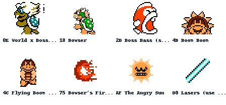

Ground Enemies
~~~~~~~~~~~~~~

29 entries.

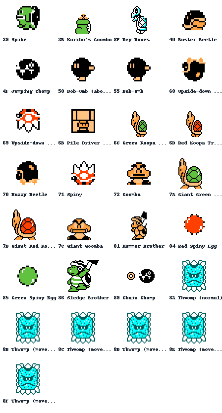

Flying Enemies
~~~~~~~~~~~~~~

11 entries.

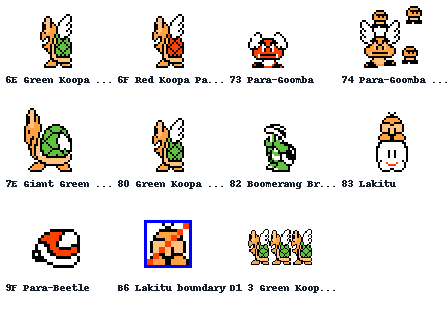

Aquatic Enemies
~~~~~~~~~~~~~~~

14 entries.

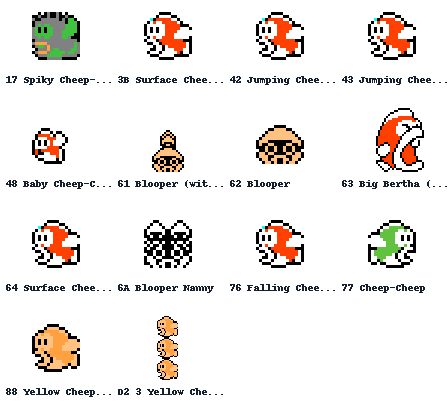

Hazards and Projectiles
~~~~~~~~~~~~~~~~~~~~~~~

33 entries.

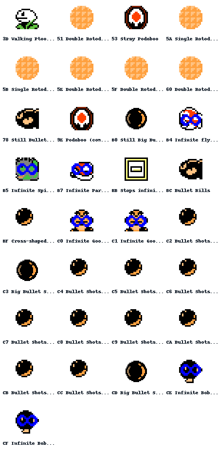

Platforms and Machinery
~~~~~~~~~~~~~~~~~~~~~~~

26 entries.

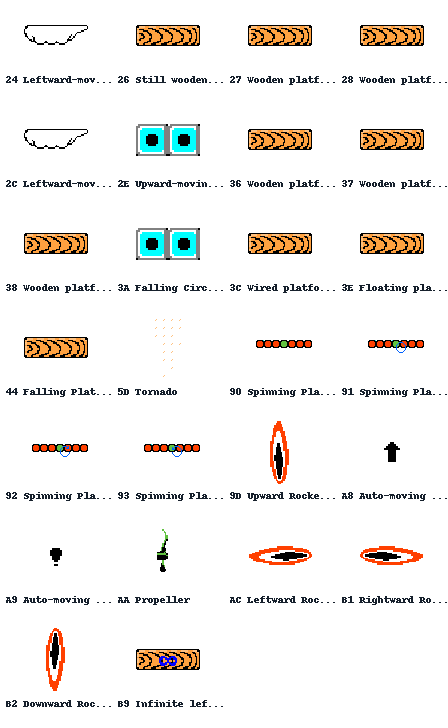

Pickups and Items
~~~~~~~~~~~~~~~~~

22 entries.

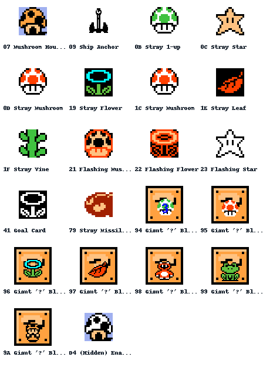

Exits and Controls
~~~~~~~~~~~~~~~~~~

7 entries.

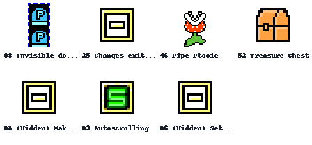

Terrain and Environmental
~~~~~~~~~~~~~~~~~~~~~~~~~

20 entries.

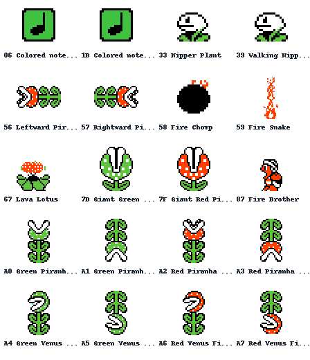

Unknown and Placeholder Entries
~~~~~~~~~~~~~~~~~~~~~~~~~~~~~~~

25 entries.

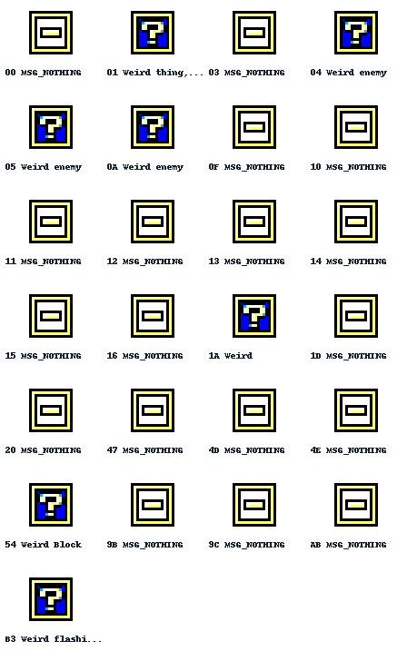

Crash Entries
~~~~~~~~~~~~~

22 entries.

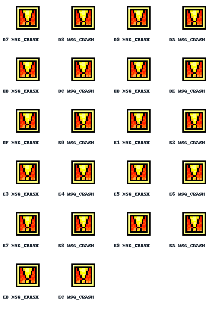

Other Entries
~~~~~~~~~~~~~

20 entries.

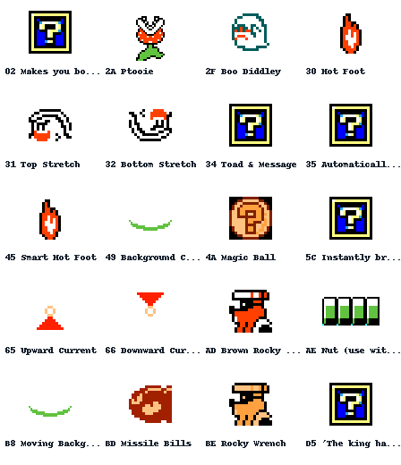

Complete Entry Index
--------------------

.. raw:: html

   

      <section class="enemy-catalog-category" id="enemy-category-bosses">
        <h3>Bosses</h3>
        

          <article class="enemy-card">
            
            <h4>0x0e World x Boss (where x = world)</h4>
            
<strong>Size:</strong> 2x2 blocks

            
<strong>Clan/group:</strong> clan 2 / group 6

            
<strong>Blocks:</strong> 0x07, 0x08, 0x17, 0x18

            
<strong>Notes:</strong> none

          </article>
          <article class="enemy-card">
            
            <h4>0x18 Bowser</h4>
            
<strong>Size:</strong> 2x3 blocks

            
<strong>Clan/group:</strong> unmatched

            
<strong>Blocks:</strong> 0x20, 0x21, 0x30, 0x31, 0x40, 0x41

            
<strong>Notes:</strong> no-clan-group-match

          </article>
          <article class="enemy-card">
            
            <h4>0x2d Boss Bass (surface)</h4>
            
<strong>Size:</strong> 2x2 blocks

            
<strong>Clan/group:</strong> clan 2 / group 8

            
<strong>Blocks:</strong> 0x34, 0x35, 0x44, 0x45

            
<strong>Notes:</strong> none

          </article>
          <article class="enemy-card">
            
            <h4>0x4b Boom Boom</h4>
            
<strong>Size:</strong> 2x2 blocks

            
<strong>Clan/group:</strong> clan 1 / group 5

            
<strong>Blocks:</strong> 0x61, 0x62, 0x71, 0x72

            
<strong>Notes:</strong> none

          </article>
          <article class="enemy-card">
            
            <h4>0x4c Flying Boom Boom</h4>
            
<strong>Size:</strong> 1x2 blocks

            
<strong>Clan/group:</strong> clan 1 / group 5

            
<strong>Blocks:</strong> 0x63, 0x73

            
<strong>Notes:</strong> none

          </article>
          <article class="enemy-card">
            
            <h4>0x75 Bowser&#x27;s Fireballs</h4>
            
<strong>Size:</strong> 1x1 blocks

            
<strong>Clan/group:</strong> unmatched

            
<strong>Blocks:</strong> 0x98

            
<strong>Notes:</strong> no-clan-group-match

          </article>
          <article class="enemy-card">
            
            <h4>0xaf The Angry Sun</h4>
            
<strong>Size:</strong> 2x2 blocks

            
<strong>Clan/group:</strong> clan 2 / group 6

            
<strong>Blocks:</strong> 0x7d, 0x7e, 0x8d, 0x8e

            
<strong>Notes:</strong> none

          </article>
          <article class="enemy-card">
            
            <h4>0xd0 Lasers (use with Bowser statues)</h4>
            
<strong>Size:</strong> 1x1 blocks

            
<strong>Clan/group:</strong> unmatched

            
<strong>Blocks:</strong> 0x4c

            
<strong>Notes:</strong> no-clan-group-match

          </article>
        

      </section>
      <section class="enemy-catalog-category" id="enemy-category-ground-enemies">
        <h3>Ground Enemies</h3>
        

          <article class="enemy-card">
            
            <h4>0x29 Spike</h4>
            
<strong>Size:</strong> 1x1 blocks

            
<strong>Clan/group:</strong> clan 2 / group 7

            
<strong>Blocks:</strong> 0x25

            
<strong>Notes:</strong> none

          </article>
          <article class="enemy-card">
            
            <h4>0x2b Kuribo&#x27;s Goomba</h4>
            
<strong>Size:</strong> 1x2 blocks

            
<strong>Clan/group:</strong> clan 2 / group 4

            
<strong>Blocks:</strong> 0x33, 0x43

            
<strong>Notes:</strong> none

          </article>
          <article class="enemy-card">
            
            <h4>0x3f Dry Bones</h4>
            
<strong>Size:</strong> 1x2 blocks

            
<strong>Clan/group:</strong> clan 1 / group 1

            
<strong>Blocks:</strong> 0x50, 0x60

            
<strong>Notes:</strong> none

          </article>
          <article class="enemy-card">
            
            <h4>0x40 Buster Beetle</h4>
            
<strong>Size:</strong> 1x1 blocks

            
<strong>Clan/group:</strong> clan 2 / group 7

            
<strong>Blocks:</strong> 0x51

            
<strong>Notes:</strong> none

          </article>
          <article class="enemy-card">
            
            <h4>0x4f Jumping Chomp</h4>
            
<strong>Size:</strong> 1x1 blocks

            
<strong>Clan/group:</strong> unmatched

            
<strong>Blocks:</strong> 0xce

            
<strong>Notes:</strong> no-clan-group-match

          </article>
          <article class="enemy-card">
            
            <h4>0x50 Bob-Omb (about to blow up)</h4>
            
<strong>Size:</strong> 1x1 blocks

            
<strong>Clan/group:</strong> clan 2 / group 5

            
<strong>Blocks:</strong> 0x68

            
<strong>Notes:</strong> none

          </article>
          <article class="enemy-card">
            
            <h4>0x55 Bob-Omb</h4>
            
<strong>Size:</strong> 1x1 blocks

            
<strong>Clan/group:</strong> clan 2 / group 4

            
<strong>Blocks:</strong> 0x68

            
<strong>Notes:</strong> none

          </article>
          <article class="enemy-card">
            
            <h4>0x68 Upside-down Buzzy Beetle</h4>
            
<strong>Size:</strong> 1x1 blocks

            
<strong>Clan/group:</strong> clan 2 / group 4

            
<strong>Blocks:</strong> 0x83

            
<strong>Notes:</strong> none

          </article>
          <article class="enemy-card">
            
            <h4>0x69 Upside-down Spiny</h4>
            
<strong>Size:</strong> 1x1 blocks

            
<strong>Clan/group:</strong> unmatched

            
<strong>Blocks:</strong> 0x84

            
<strong>Notes:</strong> no-clan-group-match

          </article>
          <article class="enemy-card">
            
            <h4>0x6b Pile Driver Micro-Goomba</h4>
            
<strong>Size:</strong> 1x1 blocks

            
<strong>Clan/group:</strong> clan 1 / group 3

            
<strong>Blocks:</strong> 0x88

            
<strong>Notes:</strong> none

          </article>
          <article class="enemy-card">
            
            <h4>0x6c Green Koopa Troopa</h4>
            
<strong>Size:</strong> 1x2 blocks

            
<strong>Clan/group:</strong> clan 1 / group 3

            
<strong>Blocks:</strong> 0x89, 0x99

            
<strong>Notes:</strong> none

          </article>
          <article class="enemy-card">
            
            <h4>0x6d Red Koopa Troopa</h4>
            
<strong>Size:</strong> 1x2 blocks

            
<strong>Clan/group:</strong> clan 1 / group 3

            
<strong>Blocks:</strong> 0x8a, 0x9a

            
<strong>Notes:</strong> none

          </article>
          <article class="enemy-card">
            
            <h4>0x70 Buzzy Beetle</h4>
            
<strong>Size:</strong> 1x1 blocks

            
<strong>Clan/group:</strong> clan 2 / group 4

            
<strong>Blocks:</strong> 0x9d

            
<strong>Notes:</strong> none

          </article>
          <article class="enemy-card">
            
            <h4>0x71 Spiny</h4>
            
<strong>Size:</strong> 1x1 blocks

            
<strong>Clan/group:</strong> clan 2 / group 4

            
<strong>Blocks:</strong> 0x9e

            
<strong>Notes:</strong> none

          </article>
          <article class="enemy-card">
            
            <h4>0x72 Goomba</h4>
            
<strong>Size:</strong> 1x1 blocks

            
<strong>Clan/group:</strong> clan 1 / group 3

            
<strong>Blocks:</strong> 0x97

            
<strong>Notes:</strong> none

          </article>
          <article class="enemy-card">
            
            <h4>0x7a Giant Green Koopa Troopa</h4>
            
<strong>Size:</strong> 2x2 blocks

            
<strong>Clan/group:</strong> unmatched

            
<strong>Blocks:</strong> 0xa8, 0xa9, 0xb8, 0xb9

            
<strong>Notes:</strong> no-clan-group-match

          </article>
          <article class="enemy-card">
            
            <h4>0x7b Giant Red Koopa Troopa</h4>
            
<strong>Size:</strong> 2x2 blocks

            
<strong>Clan/group:</strong> unmatched

            
<strong>Blocks:</strong> 0xaa, 0xab, 0xba, 0xbb

            
<strong>Notes:</strong> no-clan-group-match

          </article>
          <article class="enemy-card">
            
            <h4>0x7c Giant Goomba</h4>
            
<strong>Size:</strong> 2x2 blocks

            
<strong>Clan/group:</strong> unmatched

            
<strong>Blocks:</strong> 0xac, 0xad, 0xbc, 0xbd

            
<strong>Notes:</strong> no-clan-group-match

          </article>
          <article class="enemy-card">
            
            <h4>0x81 Hammer Brother</h4>
            
<strong>Size:</strong> 1x2 blocks

            
<strong>Clan/group:</strong> clan 2 / group 1

            
<strong>Blocks:</strong> 0xc1, 0xd1

            
<strong>Notes:</strong> none

          </article>
          <article class="enemy-card">
            
            <h4>0x84 Red Spiny Egg</h4>
            
<strong>Size:</strong> 1x1 blocks

            
<strong>Clan/group:</strong> unmatched

            
<strong>Blocks:</strong> 0xc8

            
<strong>Notes:</strong> no-clan-group-match

          </article>
          <article class="enemy-card">
            
            <h4>0x85 Green Spiny Egg</h4>
            
<strong>Size:</strong> 1x1 blocks

            
<strong>Clan/group:</strong> unmatched

            
<strong>Blocks:</strong> 0xc9

            
<strong>Notes:</strong> no-clan-group-match

          </article>
          <article class="enemy-card">
            
            <h4>0x86 Sledge Brother</h4>
            
<strong>Size:</strong> 2x2 blocks

            
<strong>Clan/group:</strong> clan 2 / group 1

            
<strong>Blocks:</strong> 0xca, 0xcb, 0xda, 0xdb

            
<strong>Notes:</strong> none

          </article>
          <article class="enemy-card">
            
            <h4>0x89 Chain Chomp</h4>
            
<strong>Size:</strong> 2x1 blocks

            
<strong>Clan/group:</strong> clan 2 / group 7

            
<strong>Blocks:</strong> 0xde, 0xce

            
<strong>Notes:</strong> none

          </article>
          <article class="enemy-card">
            
            <h4>0x8a Thwomp (normal)</h4>
            
<strong>Size:</strong> 2x2 blocks

            
<strong>Clan/group:</strong> clan 2 / group 3

            
<strong>Blocks:</strong> 0x53, 0x54, 0x10, 0x11

            
<strong>Notes:</strong> none

          </article>
          <article class="enemy-card">
            
            <h4>0x8b Thwomp (moves left)</h4>
            
<strong>Size:</strong> 2x2 blocks

            
<strong>Clan/group:</strong> clan 2 / group 3

            
<strong>Blocks:</strong> 0x53, 0x54, 0x10, 0x11

            
<strong>Notes:</strong> none

          </article>
          <article class="enemy-card">
            
            <h4>0x8c Thwomp (moves right)</h4>
            
<strong>Size:</strong> 2x2 blocks

            
<strong>Clan/group:</strong> clan 2 / group 3

            
<strong>Blocks:</strong> 0x53, 0x54, 0x10, 0x11

            
<strong>Notes:</strong> none

          </article>
          <article class="enemy-card">
            
            <h4>0x8d Thwomp (moves up)</h4>
            
<strong>Size:</strong> 2x2 blocks

            
<strong>Clan/group:</strong> clan 2 / group 3

            
<strong>Blocks:</strong> 0x53, 0x54, 0x10, 0x11

            
<strong>Notes:</strong> none

          </article>
          <article class="enemy-card">
            
            <h4>0x8e Thwomp (moves diagonally up and left)</h4>
            
<strong>Size:</strong> 2x2 blocks

            
<strong>Clan/group:</strong> clan 2 / group 3

            
<strong>Blocks:</strong> 0x53, 0x54, 0x10, 0x11

            
<strong>Notes:</strong> none

          </article>
          <article class="enemy-card">
            
            <h4>0x8f Thwomp (moves diagonally down and left)</h4>
            
<strong>Size:</strong> 2x2 blocks

            
<strong>Clan/group:</strong> clan 2 / group 3

            
<strong>Blocks:</strong> 0x53, 0x54, 0x10, 0x11

            
<strong>Notes:</strong> none

          </article>
        

      </section>
      <section class="enemy-catalog-category" id="enemy-category-flying-enemies">
        <h3>Flying Enemies</h3>
        

          <article class="enemy-card">
            
            <h4>0x6e Green Koopa Paratroopa (bounces)</h4>
            
<strong>Size:</strong> 1x2 blocks

            
<strong>Clan/group:</strong> clan 1 / group 3

            
<strong>Blocks:</strong> 0x8c, 0x9c

            
<strong>Notes:</strong> none

          </article>
          <article class="enemy-card">
            
            <h4>0x6f Red Koopa Paratroopa</h4>
            
<strong>Size:</strong> 1x2 blocks

            
<strong>Clan/group:</strong> clan 1 / group 3

            
<strong>Blocks:</strong> 0x8f, 0x9f

            
<strong>Notes:</strong> none

          </article>
          <article class="enemy-card">
            
            <h4>0x73 Para-Goomba</h4>
            
<strong>Size:</strong> 2x2 blocks

            
<strong>Clan/group:</strong> clan 1 / group 3

            
<strong>Blocks:</strong> 0xa0, 0xa1, 0xb0, 0xb1

            
<strong>Notes:</strong> none

          </article>
          <article class="enemy-card">
            
            <h4>0x74 Para-Goomba with Micro-Goombas</h4>
            
<strong>Size:</strong> 2x2 blocks

            
<strong>Clan/group:</strong> clan 1 / group 3

            
<strong>Blocks:</strong> 0xa2, 0xa3, 0xb2, 0xb3

            
<strong>Notes:</strong> none

          </article>
          <article class="enemy-card">
            
            <h4>0x7e Giant Green Koopa Paratroopa</h4>
            
<strong>Size:</strong> 2x2 blocks

            
<strong>Clan/group:</strong> unmatched

            
<strong>Blocks:</strong> 0xb4, 0xb5, 0xc4, 0xc5

            
<strong>Notes:</strong> no-clan-group-match

          </article>
          <article class="enemy-card">
            
            <h4>0x80 Green Koopa Paratroopa (doesn&#x27;t bounce)</h4>
            
<strong>Size:</strong> 1x2 blocks

            
<strong>Clan/group:</strong> clan 1 / group 3

            
<strong>Blocks:</strong> 0x8c, 0x9c

            
<strong>Notes:</strong> none

          </article>
          <article class="enemy-card">
            
            <h4>0x82 Boomerang Brother</h4>
            
<strong>Size:</strong> 1x2 blocks

            
<strong>Clan/group:</strong> clan 2 / group 1

            
<strong>Blocks:</strong> 0xc2, 0xd2

            
<strong>Notes:</strong> none

          </article>
          <article class="enemy-card">
            
            <h4>0x83 Lakitu</h4>
            
<strong>Size:</strong> 1x2 blocks

            
<strong>Clan/group:</strong> clan 2 / group 4

            
<strong>Blocks:</strong> 0xc3, 0xd3

            
<strong>Notes:</strong> none

          </article>
          <article class="enemy-card">
            
            <h4>0x9f Para-Beetle</h4>
            
<strong>Size:</strong> 1x1 blocks

            
<strong>Clan/group:</strong> clan 2 / group 2

            
<strong>Blocks:</strong> 0xdd

            
<strong>Notes:</strong> none

          </article>
          <article class="enemy-card">
            
            <h4>0xb6 Lakitu boundary</h4>
            
<strong>Size:</strong> 1x1 blocks

            
<strong>Clan/group:</strong> unmatched

            
<strong>Blocks:</strong> 0x3d

            
<strong>Notes:</strong> no-clan-group-match

          </article>
          <article class="enemy-card">
            
            <h4>0xd1 3 Green Koopa Paratroopas</h4>
            
<strong>Size:</strong> 3x2 blocks

            
<strong>Clan/group:</strong> clan 1 / group 3

            
<strong>Blocks:</strong> 0x8c, 0x8c, 0x8c, 0x9c, 0x9c, 0x9c

            
<strong>Notes:</strong> none

          </article>
        

      </section>
      <section class="enemy-catalog-category" id="enemy-category-aquatic-enemies">
        <h3>Aquatic Enemies</h3>
        

          <article class="enemy-card">
            
            <h4>0x17 Spiky Cheep-Cheep</h4>
            
<strong>Size:</strong> 1x1 blocks

            
<strong>Clan/group:</strong> clan 2 / group 8

            
<strong>Blocks:</strong> 0x09

            
<strong>Notes:</strong> none

          </article>
          <article class="enemy-card">
            
            <h4>0x3b Surface Cheep-Cheep (swims along surface)</h4>
            
<strong>Size:</strong> 1x1 blocks

            
<strong>Clan/group:</strong> clan 1 / group 3

            
<strong>Blocks:</strong> 0x48

            
<strong>Notes:</strong> none

          </article>
          <article class="enemy-card">
            
            <h4>0x42 Jumping Cheep-Cheep (3 jumps, up and right)</h4>
            
<strong>Size:</strong> 1x1 blocks

            
<strong>Clan/group:</strong> clan 1 / group 3

            
<strong>Blocks:</strong> 0x48

            
<strong>Notes:</strong> none

          </article>
          <article class="enemy-card">
            
            <h4>0x43 Jumping Cheep-Cheep (2 jumps, down and right)</h4>
            
<strong>Size:</strong> 1x1 blocks

            
<strong>Clan/group:</strong> clan 1 / group 3

            
<strong>Blocks:</strong> 0x48

            
<strong>Notes:</strong> none

          </article>
          <article class="enemy-card">
            
            <h4>0x48 Baby Cheep-Cheep</h4>
            
<strong>Size:</strong> 1x1 blocks

            
<strong>Clan/group:</strong> clan 2 / group 8

            
<strong>Blocks:</strong> 0x5b

            
<strong>Notes:</strong> none

          </article>
          <article class="enemy-card">
            
            <h4>0x61 Blooper (with babies)</h4>
            
<strong>Size:</strong> 1x2 blocks

            
<strong>Clan/group:</strong> clan 2 / group 8

            
<strong>Blocks:</strong> 0x7b, 0x8b

            
<strong>Notes:</strong> none

          </article>
          <article class="enemy-card">
            
            <h4>0x62 Blooper</h4>
            
<strong>Size:</strong> 1x1 blocks

            
<strong>Clan/group:</strong> clan 2 / group 8

            
<strong>Blocks:</strong> 0x7c

            
<strong>Notes:</strong> none

          </article>
          <article class="enemy-card">
            
            <h4>0x63 Big Bertha (underwater)</h4>
            
<strong>Size:</strong> 2x2 blocks

            
<strong>Clan/group:</strong> clan 2 / group 8

            
<strong>Blocks:</strong> 0x34, 0x35, 0x44, 0x45

            
<strong>Notes:</strong> none

          </article>
          <article class="enemy-card">
            
            <h4>0x64 Surface Cheep-Cheep (jumps out of water)</h4>
            
<strong>Size:</strong> 1x1 blocks

            
<strong>Clan/group:</strong> clan 1 / group 3

            
<strong>Blocks:</strong> 0x48

            
<strong>Notes:</strong> none

          </article>
          <article class="enemy-card">
            
            <h4>0x6a Blooper Nanny</h4>
            
<strong>Size:</strong> 1x1 blocks

            
<strong>Clan/group:</strong> clan 2 / group 8

            
<strong>Blocks:</strong> 0x87

            
<strong>Notes:</strong> none

          </article>
          <article class="enemy-card">
            
            <h4>0x76 Falling Cheep-Cheep</h4>
            
<strong>Size:</strong> 1x1 blocks

            
<strong>Clan/group:</strong> clan 1 / group 3

            
<strong>Blocks:</strong> 0x48

            
<strong>Notes:</strong> none

          </article>
          <article class="enemy-card">
            
            <h4>0x77 Cheep-Cheep</h4>
            
<strong>Size:</strong> 1x1 blocks

            
<strong>Clan/group:</strong> clan 1 / group 3

            
<strong>Blocks:</strong> 0xa5

            
<strong>Notes:</strong> none

          </article>
          <article class="enemy-card">
            
            <h4>0x88 Yellow Cheep-Cheep</h4>
            
<strong>Size:</strong> 1x1 blocks

            
<strong>Clan/group:</strong> clan 1 / group 3

            
<strong>Blocks:</strong> 0xcd

            
<strong>Notes:</strong> none

          </article>
          <article class="enemy-card">
            
            <h4>0xd2 3 Yellow Cheep-Cheeps</h4>
            
<strong>Size:</strong> 1x3 blocks

            
<strong>Clan/group:</strong> clan 1 / group 3

            
<strong>Blocks:</strong> 0xcd, 0xcd, 0xcd

            
<strong>Notes:</strong> none

          </article>
        

      </section>
      <section class="enemy-catalog-category" id="enemy-category-hazards-and-projectiles">
        <h3>Hazards and Projectiles</h3>
        

          <article class="enemy-card">
            
            <h4>0x3d Walking Ptooie (spits fireballs)</h4>
            
<strong>Size:</strong> 1x1 blocks

            
<strong>Clan/group:</strong> clan 2 / group 7

            
<strong>Blocks:</strong> 0x2f

            
<strong>Notes:</strong> none

          </article>
          <article class="enemy-card">
            
            <h4>0x51 Double Rotodisc (rotates counterclockwise)</h4>
            
<strong>Size:</strong> 1x1 blocks

            
<strong>Clan/group:</strong> clan 2 / group 3

            
<strong>Blocks:</strong> 0x74

            
<strong>Notes:</strong> none

          </article>
          <article class="enemy-card">
            
            <h4>0x53 Stray Podoboo</h4>
            
<strong>Size:</strong> 1x1 blocks

            
<strong>Clan/group:</strong> clan 2 / group 3

            
<strong>Blocks:</strong> 0x67

            
<strong>Notes:</strong> none

          </article>
          <article class="enemy-card">
            
            <h4>0x5a Single Rotodisc (rotates clockwise)</h4>
            
<strong>Size:</strong> 1x1 blocks

            
<strong>Clan/group:</strong> clan 2 / group 3

            
<strong>Blocks:</strong> 0x74

            
<strong>Notes:</strong> none

          </article>
          <article class="enemy-card">
            
            <h4>0x5b Single Rotodisc (rotates counterclockwise)</h4>
            
<strong>Size:</strong> 1x1 blocks

            
<strong>Clan/group:</strong> clan 2 / group 3

            
<strong>Blocks:</strong> 0x74

            
<strong>Notes:</strong> none

          </article>
          <article class="enemy-card">
            
            <h4>0x5e Double Rotodisc (rotates both ways, starting at sides)</h4>
            
<strong>Size:</strong> 1x1 blocks

            
<strong>Clan/group:</strong> clan 2 / group 3

            
<strong>Blocks:</strong> 0x74

            
<strong>Notes:</strong> none

          </article>
          <article class="enemy-card">
            
            <h4>0x5f Double Rotodisc (rotates both ways, starting at top)</h4>
            
<strong>Size:</strong> 1x1 blocks

            
<strong>Clan/group:</strong> clan 2 / group 3

            
<strong>Blocks:</strong> 0x74

            
<strong>Notes:</strong> none

          </article>
          <article class="enemy-card">
            
            <h4>0x60 Double Rotodisc (rotates clockwise)</h4>
            
<strong>Size:</strong> 1x1 blocks

            
<strong>Clan/group:</strong> clan 2 / group 3

            
<strong>Blocks:</strong> 0x74

            
<strong>Notes:</strong> none

          </article>
          <article class="enemy-card">
            
            <h4>0x78 Still Bullet Bill</h4>
            
<strong>Size:</strong> 1x1 blocks

            
<strong>Clan/group:</strong> clan 1 / group 3

            
<strong>Blocks:</strong> 0xa6

            
<strong>Notes:</strong> none

          </article>
          <article class="enemy-card">
            
            <h4>0x9e Podoboo (comes out of lava)</h4>
            
<strong>Size:</strong> 1x1 blocks

            
<strong>Clan/group:</strong> clan 2 / group 3

            
<strong>Blocks:</strong> 0x67

            
<strong>Notes:</strong> none

          </article>
          <article class="enemy-card">
            
            <h4>0xb0 Still Big Bullet</h4>
            
<strong>Size:</strong> 2x2 blocks

            
<strong>Clan/group:</strong> unmatched

            
<strong>Blocks:</strong> 0xd4, 0xd5, 0xe4, 0xe5

            
<strong>Notes:</strong> no-clan-group-match

          </article>
          <article class="enemy-card">
            
            <h4>0xb4 Infinite flying Cheep-Cheeps</h4>
            
<strong>Size:</strong> 1x1 blocks

            
<strong>Clan/group:</strong> clan 1 / group 3

            
<strong>Blocks:</strong> 0xa4

            
<strong>Notes:</strong> none

          </article>
          <article class="enemy-card">
            
            <h4>0xb5 Infinite Spiky Cheep-Cheeps</h4>
            
<strong>Size:</strong> 1x1 blocks

            
<strong>Clan/group:</strong> clan 2 / group 8

            
<strong>Blocks:</strong> 0x1a

            
<strong>Notes:</strong> none

          </article>
          <article class="enemy-card">
            
            <h4>0xb7 Infinite Para-Beetles</h4>
            
<strong>Size:</strong> 1x1 blocks

            
<strong>Clan/group:</strong> clan 2 / group 2

            
<strong>Blocks:</strong> 0x49

            
<strong>Notes:</strong> none

          </article>
          <article class="enemy-card">
            
            <h4>0xbb Stops infinite flying or spiky Cheep-Cheeps</h4>
            
<strong>Size:</strong> 1x1 blocks

            
<strong>Clan/group:</strong> unmatched

            
<strong>Blocks:</strong> 0x92

            
<strong>Notes:</strong> no-clan-group-match

          </article>
          <article class="enemy-card">
            
            <h4>0xbc Bullet Bills</h4>
            
<strong>Size:</strong> 1x1 blocks

            
<strong>Clan/group:</strong> clan 1 / group 3

            
<strong>Blocks:</strong> 0xa6

            
<strong>Notes:</strong> none

          </article>
          <article class="enemy-card">
            
            <h4>0xbf Cross-shaped bullet shots</h4>
            
<strong>Size:</strong> 1x1 blocks

            
<strong>Clan/group:</strong> clan 2 / group 5

            
<strong>Blocks:</strong> 0x77

            
<strong>Notes:</strong> none

          </article>
          <article class="enemy-card">
            
            <h4>0xc0 Infinite Goombas (leftward)</h4>
            
<strong>Size:</strong> 1x1 blocks

            
<strong>Clan/group:</strong> clan 2 / group 5

            
<strong>Blocks:</strong> 0x5f

            
<strong>Notes:</strong> none

          </article>
          <article class="enemy-card">
            
            <h4>0xc1 Infinite Goombas (rightward)</h4>
            
<strong>Size:</strong> 1x1 blocks

            
<strong>Clan/group:</strong> clan 2 / group 5

            
<strong>Blocks:</strong> 0x5f

            
<strong>Notes:</strong> none

          </article>
          <article class="enemy-card">
            
            <h4>0xc2 Bullet Shots (leftward)</h4>
            
<strong>Size:</strong> 1x1 blocks

            
<strong>Clan/group:</strong> clan 2 / group 5

            
<strong>Blocks:</strong> 0x77

            
<strong>Notes:</strong> none

          </article>
          <article class="enemy-card">
            
            <h4>0xc3 Big Bullet Shots (leftward)</h4>
            
<strong>Size:</strong> 2x2 blocks

            
<strong>Clan/group:</strong> clan 2 / group 5

            
<strong>Blocks:</strong> 0xd4, 0xd5, 0xe4, 0xe5

            
<strong>Notes:</strong> none

          </article>
          <article class="enemy-card">
            
            <h4>0xc4 Bullet Shots (up/left)</h4>
            
<strong>Size:</strong> 1x1 blocks

            
<strong>Clan/group:</strong> clan 2 / group 5

            
<strong>Blocks:</strong> 0x77

            
<strong>Notes:</strong> none

          </article>
          <article class="enemy-card">
            
            <h4>0xc5 Bullet Shots (up/right)</h4>
            
<strong>Size:</strong> 1x1 blocks

            
<strong>Clan/group:</strong> clan 2 / group 5

            
<strong>Blocks:</strong> 0x77

            
<strong>Notes:</strong> none

          </article>
          <article class="enemy-card">
            
            <h4>0xc6 Bullet Shots (down/left)</h4>
            
<strong>Size:</strong> 1x1 blocks

            
<strong>Clan/group:</strong> clan 2 / group 5

            
<strong>Blocks:</strong> 0x77

            
<strong>Notes:</strong> none

          </article>
          <article class="enemy-card">
            
            <h4>0xc7 Bullet Shots (down/right)</h4>
            
<strong>Size:</strong> 1x1 blocks

            
<strong>Clan/group:</strong> clan 2 / group 5

            
<strong>Blocks:</strong> 0x77

            
<strong>Notes:</strong> none

          </article>
          <article class="enemy-card">
            
            <h4>0xc8 Bullet Shots (up/left)</h4>
            
<strong>Size:</strong> 1x1 blocks

            
<strong>Clan/group:</strong> clan 2 / group 5

            
<strong>Blocks:</strong> 0x77

            
<strong>Notes:</strong> none

          </article>
          <article class="enemy-card">
            
            <h4>0xc9 Bullet Shots (up/right)</h4>
            
<strong>Size:</strong> 1x1 blocks

            
<strong>Clan/group:</strong> clan 2 / group 5

            
<strong>Blocks:</strong> 0x77

            
<strong>Notes:</strong> none

          </article>
          <article class="enemy-card">
            
            <h4>0xca Bullet Shots (down/left)</h4>
            
<strong>Size:</strong> 1x1 blocks

            
<strong>Clan/group:</strong> clan 2 / group 5

            
<strong>Blocks:</strong> 0x77

            
<strong>Notes:</strong> none

          </article>
          <article class="enemy-card">
            
            <h4>0xcb Bullet Shots (down/right)</h4>
            
<strong>Size:</strong> 1x1 blocks

            
<strong>Clan/group:</strong> clan 2 / group 5

            
<strong>Blocks:</strong> 0x77

            
<strong>Notes:</strong> none

          </article>
          <article class="enemy-card">
            
            <h4>0xcc Bullet Shots (rightward)</h4>
            
<strong>Size:</strong> 1x1 blocks

            
<strong>Clan/group:</strong> clan 2 / group 5

            
<strong>Blocks:</strong> 0x77

            
<strong>Notes:</strong> none

          </article>
          <article class="enemy-card">
            
            <h4>0xcd Big Bullet Shots (rightward)</h4>
            
<strong>Size:</strong> 2x2 blocks

            
<strong>Clan/group:</strong> clan 2 / group 5

            
<strong>Blocks:</strong> 0xd4, 0xd5, 0xe4, 0xe5

            
<strong>Notes:</strong> none

          </article>
          <article class="enemy-card">
            
            <h4>0xce Infinite Bob-Ombs (leftward) (use with bullet shooters)</h4>
            
<strong>Size:</strong> 1x1 blocks

            
<strong>Clan/group:</strong> clan 2 / group 4

            
<strong>Blocks:</strong> 0x16

            
<strong>Notes:</strong> none

          </article>
          <article class="enemy-card">
            
            <h4>0xcf Infinite Bob-Ombs (rightward) (use with bullet shooters)</h4>
            
<strong>Size:</strong> 1x1 blocks

            
<strong>Clan/group:</strong> clan 2 / group 4

            
<strong>Blocks:</strong> 0x16

            
<strong>Notes:</strong> none

          </article>
        

      </section>
      <section class="enemy-catalog-category" id="enemy-category-platforms-and-machinery">
        <h3>Platforms and Machinery</h3>
        

          <article class="enemy-card">
            
            <h4>0x24 Leftward-moving cloud platform (fast)</h4>
            
<strong>Size:</strong> 3x1 blocks

            
<strong>Clan/group:</strong> unmatched

            
<strong>Blocks:</strong> 0x26, 0x27, 0x28

            
<strong>Notes:</strong> no-clan-group-match

          </article>
          <article class="enemy-card">
            
            <h4>0x26 Still wooden platform (moves right when stepped on)</h4>
            
<strong>Size:</strong> 3x1 blocks

            
<strong>Clan/group:</strong> unmatched

            
<strong>Blocks:</strong> 0x37, 0x38, 0x39

            
<strong>Notes:</strong> no-clan-group-match

          </article>
          <article class="enemy-card">
            
            <h4>0x27 Wooden platform - moves back and forth (a lot)</h4>
            
<strong>Size:</strong> 3x1 blocks

            
<strong>Clan/group:</strong> unmatched

            
<strong>Blocks:</strong> 0x37, 0x38, 0x39

            
<strong>Notes:</strong> no-clan-group-match

          </article>
          <article class="enemy-card">
            
            <h4>0x28 Wooden platform - moves up and down (a lot)</h4>
            
<strong>Size:</strong> 3x1 blocks

            
<strong>Clan/group:</strong> unmatched

            
<strong>Blocks:</strong> 0x37, 0x38, 0x39

            
<strong>Notes:</strong> no-clan-group-match

          </article>
          <article class="enemy-card">
            
            <h4>0x2c Leftward-moving cloud platform (slow)</h4>
            
<strong>Size:</strong> 3x1 blocks

            
<strong>Clan/group:</strong> unmatched

            
<strong>Blocks:</strong> 0x26, 0x27, 0x28

            
<strong>Notes:</strong> no-clan-group-match

          </article>
          <article class="enemy-card">
            
            <h4>0x2e Upward-moving Circle Block platform</h4>
            
<strong>Size:</strong> 2x1 blocks

            
<strong>Clan/group:</strong> unmatched

            
<strong>Blocks:</strong> 0x36, 0x36

            
<strong>Notes:</strong> no-clan-group-match

          </article>
          <article class="enemy-card">
            
            <h4>0x36 Wooden platform - moves left,falls when stepped on</h4>
            
<strong>Size:</strong> 3x1 blocks

            
<strong>Clan/group:</strong> unmatched

            
<strong>Blocks:</strong> 0x37, 0x38, 0x39

            
<strong>Notes:</strong> no-clan-group-match

          </article>
          <article class="enemy-card">
            
            <h4>0x37 Wooden platform - moves back and forth (a little)</h4>
            
<strong>Size:</strong> 3x1 blocks

            
<strong>Clan/group:</strong> unmatched

            
<strong>Blocks:</strong> 0x37, 0x38, 0x39

            
<strong>Notes:</strong> no-clan-group-match

          </article>
          <article class="enemy-card">
            
            <h4>0x38 Wooden platform - moves up and down (a little)</h4>
            
<strong>Size:</strong> 3x1 blocks

            
<strong>Clan/group:</strong> unmatched

            
<strong>Blocks:</strong> 0x37, 0x38, 0x39

            
<strong>Notes:</strong> no-clan-group-match

          </article>
          <article class="enemy-card">
            
            <h4>0x3a Falling Circle Block platform</h4>
            
<strong>Size:</strong> 2x1 blocks

            
<strong>Clan/group:</strong> unmatched

            
<strong>Blocks:</strong> 0x36, 0x36

            
<strong>Notes:</strong> no-clan-group-match

          </article>
          <article class="enemy-card">
            
            <h4>0x3c Wired platform (follows platform wires)</h4>
            
<strong>Size:</strong> 3x1 blocks

            
<strong>Clan/group:</strong> clan 2 / group 2

            
<strong>Blocks:</strong> 0x37, 0x38, 0x39

            
<strong>Notes:</strong> none

          </article>
          <article class="enemy-card">
            
            <h4>0x3e Floating platform (floats in water)</h4>
            
<strong>Size:</strong> 3x1 blocks

            
<strong>Clan/group:</strong> unmatched

            
<strong>Blocks:</strong> 0x37, 0x38, 0x39

            
<strong>Notes:</strong> no-clan-group-match

          </article>
          <article class="enemy-card">
            
            <h4>0x44 Falling Platform (falls when stepped on)</h4>
            
<strong>Size:</strong> 3x1 blocks

            
<strong>Clan/group:</strong> clan 2 / group 2

            
<strong>Blocks:</strong> 0x37, 0x38, 0x39

            
<strong>Notes:</strong> none

          </article>
          <article class="enemy-card">
            
            <h4>0x5d Tornado</h4>
            
<strong>Size:</strong> 4x8 blocks

            
<strong>Clan/group:</strong> unmatched

            
<strong>Blocks:</strong> 0x76, 0x76, 0x76, 0x76, 0x76, 0x76, 0x76, 0x76, 0x76, 0x76, 0x76, 0x00, 0x00, 0x76, 0x76, 0x76, 0x00, 0x76, 0x76, 0x00, 0x00, 0x76, 0x76, 0x00, 0x00, 0x00, 0x76, 0x00, 0x00, 0x76, 0x00, 0x00

            
<strong>Notes:</strong> no-clan-group-match

          </article>
          <article class="enemy-card">
            
            <h4>0x90 Spinning Platform (step-activated)</h4>
            
<strong>Size:</strong> 4x1 blocks

            
<strong>Clan/group:</strong> clan 1 / group 3

            
<strong>Blocks:</strong> 0xf6, 0xf5, 0xf4, 0xf5

            
<strong>Notes:</strong> none

          </article>
          <article class="enemy-card">
            
            <h4>0x91 Spinning Platform (constant)</h4>
            
<strong>Size:</strong> 4x1 blocks

            
<strong>Clan/group:</strong> clan 1 / group 3

            
<strong>Blocks:</strong> 0xf6, 0xf5, 0xf7, 0xf5

            
<strong>Notes:</strong> none

          </article>
          <article class="enemy-card">
            
            <h4>0x92 Spinning Platform (periodical clockwise)</h4>
            
<strong>Size:</strong> 4x1 blocks

            
<strong>Clan/group:</strong> clan 1 / group 3

            
<strong>Blocks:</strong> 0xf6, 0xf5, 0xf8, 0xf5

            
<strong>Notes:</strong> none

          </article>
          <article class="enemy-card">
            
            <h4>0x93 Spinning Platform (periodical counterclockwise)</h4>
            
<strong>Size:</strong> 4x1 blocks

            
<strong>Clan/group:</strong> clan 1 / group 3

            
<strong>Blocks:</strong> 0xf6, 0xf5, 0xf9, 0xf5

            
<strong>Notes:</strong> none

          </article>
          <article class="enemy-card">
            
            <h4>0x9d Upward Rocket Engine</h4>
            
<strong>Size:</strong> 1x3 blocks

            
<strong>Clan/group:</strong> clan 1 / group 2

            
<strong>Blocks:</strong> 0x1c, 0x2c, 0x3c

            
<strong>Notes:</strong> none

          </article>
          <article class="enemy-card">
            
            <h4>0xa8 Auto-moving upward directional platform</h4>
            
<strong>Size:</strong> 2x1 blocks

            
<strong>Clan/group:</strong> clan 2 / group 3

            
<strong>Blocks:</strong> 0x0d, 0x0e

            
<strong>Notes:</strong> none

          </article>
          <article class="enemy-card">
            
            <h4>0xa9 Auto-moving multi-directional platform</h4>
            
<strong>Size:</strong> 2x1 blocks

            
<strong>Clan/group:</strong> clan 2 / group 3

            
<strong>Blocks:</strong> 0x1d, 0x1e

            
<strong>Notes:</strong> none

          </article>
          <article class="enemy-card">
            
            <h4>0xaa Propeller</h4>
            
<strong>Size:</strong> 1x3 blocks

            
<strong>Clan/group:</strong> clan 2 / group 5

            
<strong>Blocks:</strong> 0x100, 0x101, 0x102

            
<strong>Notes:</strong> none

          </article>
          <article class="enemy-card">
            
            <h4>0xac Leftward Rocket Engine</h4>
            
<strong>Size:</strong> 3x1 blocks

            
<strong>Clan/group:</strong> clan 1 / group 2

            
<strong>Blocks:</strong> 0x22, 0x23, 0x24

            
<strong>Notes:</strong> none

          </article>
          <article class="enemy-card">
            
            <h4>0xb1 Rightward Rocket Engine</h4>
            
<strong>Size:</strong> 3x1 blocks

            
<strong>Clan/group:</strong> clan 1 / group 2

            
<strong>Blocks:</strong> 0x78, 0x79, 0x7a

            
<strong>Notes:</strong> none

          </article>
          <article class="enemy-card">
            
            <h4>0xb2 Downward Rocket Engine</h4>
            
<strong>Size:</strong> 1x3 blocks

            
<strong>Clan/group:</strong> clan 1 / group 2

            
<strong>Blocks:</strong> 0x65, 0x75, 0x64

            
<strong>Notes:</strong> none

          </article>
          <article class="enemy-card">
            
            <h4>0xb9 Infinite leftward-moving falling platforms</h4>
            
<strong>Size:</strong> 3x1 blocks

            
<strong>Clan/group:</strong> clan 2 / group 2

            
<strong>Blocks:</strong> 0x37, 0x7f, 0x39

            
<strong>Notes:</strong> none

          </article>
        

      </section>
      <section class="enemy-catalog-category" id="enemy-category-pickups-and-items">
        <h3>Pickups and Items</h3>
        

          <article class="enemy-card">
            
            <h4>0x07 Mushroom House with Warp Whistle entrance</h4>
            
<strong>Size:</strong> 1x1 blocks

            
<strong>Clan/group:</strong> unmatched

            
<strong>Blocks:</strong> 0x46

            
<strong>Notes:</strong> no-clan-group-match

          </article>
          <article class="enemy-card">
            
            <h4>0x09 Ship Anchor</h4>
            
<strong>Size:</strong> 3x2 blocks

            
<strong>Clan/group:</strong> unmatched

            
<strong>Blocks:</strong> 0x00, 0x106, 0x00, 0x103, 0x104, 0x105

            
<strong>Notes:</strong> no-clan-group-match

          </article>
          <article class="enemy-card">
            
            <h4>0x0b Stray 1-up</h4>
            
<strong>Size:</strong> 1x1 blocks

            
<strong>Clan/group:</strong> unmatched

            
<strong>Blocks:</strong> 0x04

            
<strong>Notes:</strong> no-clan-group-match

          </article>
          <article class="enemy-card">
            
            <h4>0x0c Stray Star</h4>
            
<strong>Size:</strong> 1x1 blocks

            
<strong>Clan/group:</strong> unmatched

            
<strong>Blocks:</strong> 0x05

            
<strong>Notes:</strong> no-clan-group-match

          </article>
          <article class="enemy-card">
            
            <h4>0x0d Stray Mushroom</h4>
            
<strong>Size:</strong> 1x1 blocks

            
<strong>Clan/group:</strong> unmatched

            
<strong>Blocks:</strong> 0x06

            
<strong>Notes:</strong> no-clan-group-match

          </article>
          <article class="enemy-card">
            
            <h4>0x19 Stray Flower</h4>
            
<strong>Size:</strong> 1x1 blocks

            
<strong>Clan/group:</strong> unmatched

            
<strong>Blocks:</strong> 0x13

            
<strong>Notes:</strong> no-clan-group-match

          </article>
          <article class="enemy-card">
            
            <h4>0x1c Stray Mushroom</h4>
            
<strong>Size:</strong> 1x1 blocks

            
<strong>Clan/group:</strong> unmatched

            
<strong>Blocks:</strong> 0x06

            
<strong>Notes:</strong> no-clan-group-match

          </article>
          <article class="enemy-card">
            
            <h4>0x1e Stray Leaf</h4>
            
<strong>Size:</strong> 1x1 blocks

            
<strong>Clan/group:</strong> unmatched

            
<strong>Blocks:</strong> 0x15

            
<strong>Notes:</strong> no-clan-group-match

          </article>
          <article class="enemy-card">
            
            <h4>0x1f Stray Vine</h4>
            
<strong>Size:</strong> 1x1 blocks

            
<strong>Clan/group:</strong> unmatched

            
<strong>Blocks:</strong> 0x19

            
<strong>Notes:</strong> no-clan-group-match

          </article>
          <article class="enemy-card">
            
            <h4>0x21 Flashing Mushroom</h4>
            
<strong>Size:</strong> 1x1 blocks

            
<strong>Clan/group:</strong> unmatched

            
<strong>Blocks:</strong> 0x0a

            
<strong>Notes:</strong> no-clan-group-match

          </article>
          <article class="enemy-card">
            
            <h4>0x22 Flashing Flower</h4>
            
<strong>Size:</strong> 1x1 blocks

            
<strong>Clan/group:</strong> unmatched

            
<strong>Blocks:</strong> 0x0b

            
<strong>Notes:</strong> no-clan-group-match

          </article>
          <article class="enemy-card">
            
            <h4>0x23 Flashing Star</h4>
            
<strong>Size:</strong> 1x1 blocks

            
<strong>Clan/group:</strong> unmatched

            
<strong>Blocks:</strong> 0x0c

            
<strong>Notes:</strong> no-clan-group-match

          </article>
          <article class="enemy-card">
            
            <h4>0x41 Goal Card</h4>
            
<strong>Size:</strong> 1x1 blocks

            
<strong>Clan/group:</strong> unmatched

            
<strong>Blocks:</strong> 0x52

            
<strong>Notes:</strong> no-clan-group-match

          </article>
          <article class="enemy-card">
            
            <h4>0x79 Stray Missile Bill</h4>
            
<strong>Size:</strong> 1x1 blocks

            
<strong>Clan/group:</strong> clan 1 / group 3

            
<strong>Blocks:</strong> 0xa7

            
<strong>Notes:</strong> none

          </article>
          <article class="enemy-card">
            
            <h4>0x94 Giant &#x27;?&#x27; Block with 3 1-ups</h4>
            
<strong>Size:</strong> 2x2 blocks

            
<strong>Clan/group:</strong> unmatched

            
<strong>Blocks:</strong> 0xec, 0xed, 0xfc, 0xfd

            
<strong>Notes:</strong> no-clan-group-match

          </article>
          <article class="enemy-card">
            
            <h4>0x95 Giant &#x27;?&#x27; Block with Mushroom</h4>
            
<strong>Size:</strong> 2x2 blocks

            
<strong>Clan/group:</strong> unmatched

            
<strong>Blocks:</strong> 0xee, 0xef, 0xfe, 0xff

            
<strong>Notes:</strong> no-clan-group-match

          </article>
          <article class="enemy-card">
            
            <h4>0x96 Giant &#x27;?&#x27; Block with Flower</h4>
            
<strong>Size:</strong> 2x2 blocks

            
<strong>Clan/group:</strong> unmatched

            
<strong>Blocks:</strong> 0xea, 0xeb, 0xfa, 0xfb

            
<strong>Notes:</strong> no-clan-group-match

          </article>
          <article class="enemy-card">
            
            <h4>0x97 Giant &#x27;?&#x27; Block with Leaf</h4>
            
<strong>Size:</strong> 2x2 blocks

            
<strong>Clan/group:</strong> unmatched

            
<strong>Blocks:</strong> 0xd8, 0xd9, 0xe8, 0xe9

            
<strong>Notes:</strong> no-clan-group-match

          </article>
          <article class="enemy-card">
            
            <h4>0x98 Giant &#x27;?&#x27; Block with Tanooki Suit</h4>
            
<strong>Size:</strong> 2x2 blocks

            
<strong>Clan/group:</strong> unmatched

            
<strong>Blocks:</strong> 0xd6, 0xd7, 0xe6, 0xe7

            
<strong>Notes:</strong> no-clan-group-match

          </article>
          <article class="enemy-card">
            
            <h4>0x99 Giant &#x27;?&#x27; Block with Frog Suit</h4>
            
<strong>Size:</strong> 2x2 blocks

            
<strong>Clan/group:</strong> unmatched

            
<strong>Blocks:</strong> 0xe2, 0xe3, 0xf2, 0xf3

            
<strong>Notes:</strong> no-clan-group-match

          </article>
          <article class="enemy-card">
            
            <h4>0x9a Giant &#x27;?&#x27; Block with Hammer Bros. Suit</h4>
            
<strong>Size:</strong> 2x2 blocks

            
<strong>Clan/group:</strong> unmatched

            
<strong>Blocks:</strong> 0xe0, 0xe1, 0xf0, 0xf1

            
<strong>Notes:</strong> no-clan-group-match

          </article>
          <article class="enemy-card">
            
            <h4>0xd4 (Hidden) Enables White Mushroom House</h4>
            
<strong>Size:</strong> 1x1 blocks

            
<strong>Clan/group:</strong> unmatched

            
<strong>Blocks:</strong> 0x47

            
<strong>Notes:</strong> no-clan-group-match

          </article>
        

      </section>
      <section class="enemy-catalog-category" id="enemy-category-exits-and-controls">
        <h3>Exits and Controls</h3>
        

          <article class="enemy-card">
            
            <h4>0x08 Invisible door (appears when you hit a P-switch)</h4>
            
<strong>Size:</strong> 1x2 blocks

            
<strong>Clan/group:</strong> clan 1 / group 1

            
<strong>Blocks:</strong> 0x2a, 0x2b

            
<strong>Notes:</strong> none

          </article>
          <article class="enemy-card">
            
            <h4>0x25 Changes exit location on map (works on warp pipe levels)</h4>
            
<strong>Size:</strong> 1x1 blocks

            
<strong>Clan/group:</strong> unmatched

            
<strong>Blocks:</strong> 0x92

            
<strong>Notes:</strong> no-clan-group-match

          </article>
          <article class="enemy-card">
            
            <h4>0x46 Pipe Ptooie</h4>
            
<strong>Size:</strong> 2x2 blocks

            
<strong>Clan/group:</strong> clan 2 / group 7

            
<strong>Blocks:</strong> 0x117, 0x118, 0x119, 0x11a

            
<strong>Notes:</strong> none

          </article>
          <article class="enemy-card">
            
            <h4>0x52 Treasure Chest</h4>
            
<strong>Size:</strong> 1x1 blocks

            
<strong>Clan/group:</strong> unmatched

            
<strong>Blocks:</strong> 0x66

            
<strong>Notes:</strong> no-clan-group-match

          </article>
          <article class="enemy-card">
            
            <h4>0xba (Hidden) Makes treasure chest end the level</h4>
            
<strong>Size:</strong> 1x1 blocks

            
<strong>Clan/group:</strong> unmatched

            
<strong>Blocks:</strong> 0x92

            
<strong>Notes:</strong> no-clan-group-match

          </article>
          <article class="enemy-card">
            
            <h4>0xd3 Autoscrolling</h4>
            
<strong>Size:</strong> 1x1 blocks

            
<strong>Clan/group:</strong> unmatched

            
<strong>Blocks:</strong> 0x93

            
<strong>Notes:</strong> no-clan-group-match

          </article>
          <article class="enemy-card">
            
            <h4>0xd6 (Hidden) Sets reward item in treasure chests</h4>
            
<strong>Size:</strong> 1x1 blocks

            
<strong>Clan/group:</strong> unmatched

            
<strong>Blocks:</strong> 0x92

            
<strong>Notes:</strong> no-clan-group-match

          </article>
        

      </section>
      <section class="enemy-catalog-category" id="enemy-category-terrain-and-environmental">
        <h3>Terrain and Environmental</h3>
        

          <article class="enemy-card">
            
            <h4>0x06 Colored note block</h4>
            
<strong>Size:</strong> 1x1 blocks

            
<strong>Clan/group:</strong> unmatched

            
<strong>Blocks:</strong> 0x14

            
<strong>Notes:</strong> no-clan-group-match

          </article>
          <article class="enemy-card">
            
            <h4>0x1b Colored note block</h4>
            
<strong>Size:</strong> 1x1 blocks

            
<strong>Clan/group:</strong> unmatched

            
<strong>Blocks:</strong> 0x14

            
<strong>Notes:</strong> no-clan-group-match

          </article>
          <article class="enemy-card">
            
            <h4>0x33 Nipper Plant</h4>
            
<strong>Size:</strong> 1x1 blocks

            
<strong>Clan/group:</strong> clan 2 / group 7

            
<strong>Blocks:</strong> 0x2f

            
<strong>Notes:</strong> none

          </article>
          <article class="enemy-card">
            
            <h4>0x39 Walking Nipper Plant</h4>
            
<strong>Size:</strong> 1x1 blocks

            
<strong>Clan/group:</strong> clan 2 / group 7

            
<strong>Blocks:</strong> 0x2f

            
<strong>Notes:</strong> none

          </article>
          <article class="enemy-card">
            
            <h4>0x56 Leftward Piranha Plant</h4>
            
<strong>Size:</strong> 2x2 blocks

            
<strong>Clan/group:</strong> clan 1 / group 3

            
<strong>Blocks:</strong> 0x11b, 0x11c, 0x11d, 0x11e

            
<strong>Notes:</strong> none

          </article>
          <article class="enemy-card">
            
            <h4>0x57 Rightward Piranha Plant</h4>
            
<strong>Size:</strong> 2x2 blocks

            
<strong>Clan/group:</strong> clan 1 / group 3

            
<strong>Blocks:</strong> 0x11f, 0x120, 0x121, 0x122

            
<strong>Notes:</strong> none

          </article>
          <article class="enemy-card">
            
            <h4>0x58 Fire Chomp</h4>
            
<strong>Size:</strong> 1x1 blocks

            
<strong>Clan/group:</strong> clan 2 / group 2

            
<strong>Blocks:</strong> 0x6f

            
<strong>Notes:</strong> none

          </article>
          <article class="enemy-card">
            
            <h4>0x59 Fire Snake</h4>
            
<strong>Size:</strong> 1x3 blocks

            
<strong>Clan/group:</strong> clan 2 / group 2

            
<strong>Blocks:</strong> 0x70, 0x80, 0x90

            
<strong>Notes:</strong> none

          </article>
          <article class="enemy-card">
            
            <h4>0x67 Lava Lotus</h4>
            
<strong>Size:</strong> 2x2 blocks

            
<strong>Clan/group:</strong> clan 1 / group 4

            
<strong>Blocks:</strong> 0x85, 0x86, 0x95, 0x96

            
<strong>Notes:</strong> none

          </article>
          <article class="enemy-card">
            
            <h4>0x7d Giant Green Piranha Plant</h4>
            
<strong>Size:</strong> 2x2 blocks

            
<strong>Clan/group:</strong> unmatched

            
<strong>Blocks:</strong> 0xae, 0xaf, 0xbe, 0xbf

            
<strong>Notes:</strong> no-clan-group-match

          </article>
          <article class="enemy-card">
            
            <h4>0x7f Giant Red Piranha Plant</h4>
            
<strong>Size:</strong> 2x2 blocks

            
<strong>Clan/group:</strong> unmatched

            
<strong>Blocks:</strong> 0xb6, 0xb7, 0xc6, 0xc7

            
<strong>Notes:</strong> no-clan-group-match

          </article>
          <article class="enemy-card">
            
            <h4>0x87 Fire Brother</h4>
            
<strong>Size:</strong> 1x2 blocks

            
<strong>Clan/group:</strong> clan 2 / group 1

            
<strong>Blocks:</strong> 0xcc, 0xdc

            
<strong>Notes:</strong> none

          </article>
          <article class="enemy-card">
            
            <h4>0xa0 Green Piranha Plant (upward)</h4>
            
<strong>Size:</strong> 2x2 blocks

            
<strong>Clan/group:</strong> clan 1 / group 3

            
<strong>Blocks:</strong> 0x10b, 0x10c, 0x02, 0x03

            
<strong>Notes:</strong> none

          </article>
          <article class="enemy-card">
            
            <h4>0xa1 Green Piranha Plant (downward)</h4>
            
<strong>Size:</strong> 2x2 blocks

            
<strong>Clan/group:</strong> clan 1 / group 3

            
<strong>Blocks:</strong> 0x3e, 0x3f, 0x111, 0x112

            
<strong>Notes:</strong> none

          </article>
          <article class="enemy-card">
            
            <h4>0xa2 Red Piranha Plant (upward)</h4>
            
<strong>Size:</strong> 2x2 blocks

            
<strong>Clan/group:</strong> clan 1 / group 3

            
<strong>Blocks:</strong> 0x10d, 0x10e, 0x02, 0x03

            
<strong>Notes:</strong> none

          </article>
          <article class="enemy-card">
            
            <h4>0xa3 Red Piranha Plant (downward)</h4>
            
<strong>Size:</strong> 2x2 blocks

            
<strong>Clan/group:</strong> clan 1 / group 3

            
<strong>Blocks:</strong> 0x3e, 0x3f, 0x10f, 0x110

            
<strong>Notes:</strong> none

          </article>
          <article class="enemy-card">
            
            <h4>0xa4 Green Venus Fire Trap (upward)</h4>
            
<strong>Size:</strong> 2x2 blocks

            
<strong>Clan/group:</strong> clan 1 / group 3

            
<strong>Blocks:</strong> 0x107, 0x108, 0x02, 0x03

            
<strong>Notes:</strong> none

          </article>
          <article class="enemy-card">
            
            <h4>0xa5 Green Venus Fire Trap (downward)</h4>
            
<strong>Size:</strong> 2x2 blocks

            
<strong>Clan/group:</strong> clan 1 / group 3

            
<strong>Blocks:</strong> 0x3e, 0x3f, 0x113, 0x114

            
<strong>Notes:</strong> none

          </article>
          <article class="enemy-card">
            
            <h4>0xa6 Red Venus Fire Trap (upward)</h4>
            
<strong>Size:</strong> 2x2 blocks

            
<strong>Clan/group:</strong> clan 1 / group 3

            
<strong>Blocks:</strong> 0x109, 0x10a, 0x02, 0x03

            
<strong>Notes:</strong> none

          </article>
          <article class="enemy-card">
            
            <h4>0xa7 Red Venus Fire Trap (downward)</h4>
            
<strong>Size:</strong> 2x2 blocks

            
<strong>Clan/group:</strong> clan 1 / group 3

            
<strong>Blocks:</strong> 0x3e, 0x3f, 0x115, 0x116

            
<strong>Notes:</strong> none

          </article>
        

      </section>
      <section class="enemy-catalog-category" id="enemy-category-unknown-and-placeholder-entries">
        <h3>Unknown and Placeholder Entries</h3>
        

          <article class="enemy-card">
            
            <h4>0x00 MSG_NOTHING</h4>
            
<strong>Size:</strong> 1x1 blocks

            
<strong>Clan/group:</strong> unmatched

            
<strong>Blocks:</strong> 0x92

            
<strong>Notes:</strong> no-clan-group-match

          </article>
          <article class="enemy-card">
            
            <h4>0x01 Weird thing, can slip on</h4>
            
<strong>Size:</strong> 1x1 blocks

            
<strong>Clan/group:</strong> unmatched

            
<strong>Blocks:</strong> 0x94

            
<strong>Notes:</strong> no-clan-group-match

          </article>
          <article class="enemy-card">
            
            <h4>0x03 MSG_NOTHING</h4>
            
<strong>Size:</strong> 1x1 blocks

            
<strong>Clan/group:</strong> unmatched

            
<strong>Blocks:</strong> 0x92

            
<strong>Notes:</strong> no-clan-group-match

          </article>
          <article class="enemy-card">
            
            <h4>0x04 Weird enemy</h4>
            
<strong>Size:</strong> 1x1 blocks

            
<strong>Clan/group:</strong> unmatched

            
<strong>Blocks:</strong> 0x94

            
<strong>Notes:</strong> no-clan-group-match

          </article>
          <article class="enemy-card">
            
            <h4>0x05 Weird enemy</h4>
            
<strong>Size:</strong> 1x1 blocks

            
<strong>Clan/group:</strong> unmatched

            
<strong>Blocks:</strong> 0x94

            
<strong>Notes:</strong> no-clan-group-match

          </article>
          <article class="enemy-card">
            
            <h4>0x0a Weird enemy</h4>
            
<strong>Size:</strong> 1x1 blocks

            
<strong>Clan/group:</strong> unmatched

            
<strong>Blocks:</strong> 0x94

            
<strong>Notes:</strong> no-clan-group-match

          </article>
          <article class="enemy-card">
            
            <h4>0x0f MSG_NOTHING</h4>
            
<strong>Size:</strong> 1x1 blocks

            
<strong>Clan/group:</strong> unmatched

            
<strong>Blocks:</strong> 0x92

            
<strong>Notes:</strong> no-clan-group-match

          </article>
          <article class="enemy-card">
            
            <h4>0x10 MSG_NOTHING</h4>
            
<strong>Size:</strong> 1x1 blocks

            
<strong>Clan/group:</strong> unmatched

            
<strong>Blocks:</strong> 0x92

            
<strong>Notes:</strong> no-clan-group-match

          </article>
          <article class="enemy-card">
            
            <h4>0x11 MSG_NOTHING</h4>
            
<strong>Size:</strong> 1x1 blocks

            
<strong>Clan/group:</strong> unmatched

            
<strong>Blocks:</strong> 0x92

            
<strong>Notes:</strong> no-clan-group-match

          </article>
          <article class="enemy-card">
            
            <h4>0x12 MSG_NOTHING</h4>
            
<strong>Size:</strong> 1x1 blocks

            
<strong>Clan/group:</strong> unmatched

            
<strong>Blocks:</strong> 0x92

            
<strong>Notes:</strong> no-clan-group-match

          </article>
          <article class="enemy-card">
            
            <h4>0x13 MSG_NOTHING</h4>
            
<strong>Size:</strong> 1x1 blocks

            
<strong>Clan/group:</strong> unmatched

            
<strong>Blocks:</strong> 0x92

            
<strong>Notes:</strong> no-clan-group-match

          </article>
          <article class="enemy-card">
            
            <h4>0x14 MSG_NOTHING</h4>
            
<strong>Size:</strong> 1x1 blocks

            
<strong>Clan/group:</strong> unmatched

            
<strong>Blocks:</strong> 0x92

            
<strong>Notes:</strong> no-clan-group-match

          </article>
          <article class="enemy-card">
            
            <h4>0x15 MSG_NOTHING</h4>
            
<strong>Size:</strong> 1x1 blocks

            
<strong>Clan/group:</strong> unmatched

            
<strong>Blocks:</strong> 0x92

            
<strong>Notes:</strong> no-clan-group-match

          </article>
          <article class="enemy-card">
            
            <h4>0x16 MSG_NOTHING</h4>
            
<strong>Size:</strong> 1x1 blocks

            
<strong>Clan/group:</strong> unmatched

            
<strong>Blocks:</strong> 0x92

            
<strong>Notes:</strong> no-clan-group-match

          </article>
          <article class="enemy-card">
            
            <h4>0x1a Weird</h4>
            
<strong>Size:</strong> 1x1 blocks

            
<strong>Clan/group:</strong> unmatched

            
<strong>Blocks:</strong> 0x94

            
<strong>Notes:</strong> no-clan-group-match

          </article>
          <article class="enemy-card">
            
            <h4>0x1d MSG_NOTHING</h4>
            
<strong>Size:</strong> 1x1 blocks

            
<strong>Clan/group:</strong> unmatched

            
<strong>Blocks:</strong> 0x92

            
<strong>Notes:</strong> no-clan-group-match

          </article>
          <article class="enemy-card">
            
            <h4>0x20 MSG_NOTHING</h4>
            
<strong>Size:</strong> 1x1 blocks

            
<strong>Clan/group:</strong> unmatched

            
<strong>Blocks:</strong> 0x92

            
<strong>Notes:</strong> no-clan-group-match

          </article>
          <article class="enemy-card">
            
            <h4>0x47 MSG_NOTHING</h4>
            
<strong>Size:</strong> 1x1 blocks

            
<strong>Clan/group:</strong> unmatched

            
<strong>Blocks:</strong> 0x92

            
<strong>Notes:</strong> no-clan-group-match

          </article>
          <article class="enemy-card">
            
            <h4>0x4d MSG_NOTHING</h4>
            
<strong>Size:</strong> 1x1 blocks

            
<strong>Clan/group:</strong> unmatched

            
<strong>Blocks:</strong> 0x92

            
<strong>Notes:</strong> no-clan-group-match

          </article>
          <article class="enemy-card">
            
            <h4>0x4e MSG_NOTHING</h4>
            
<strong>Size:</strong> 1x1 blocks

            
<strong>Clan/group:</strong> unmatched

            
<strong>Blocks:</strong> 0x92

            
<strong>Notes:</strong> no-clan-group-match

          </article>
          <article class="enemy-card">
            
            <h4>0x54 Weird Block</h4>
            
<strong>Size:</strong> 1x1 blocks

            
<strong>Clan/group:</strong> unmatched

            
<strong>Blocks:</strong> 0x94

            
<strong>Notes:</strong> no-clan-group-match

          </article>
          <article class="enemy-card">
            
            <h4>0x9b MSG_NOTHING</h4>
            
<strong>Size:</strong> 1x1 blocks

            
<strong>Clan/group:</strong> unmatched

            
<strong>Blocks:</strong> 0x92

            
<strong>Notes:</strong> no-clan-group-match

          </article>
          <article class="enemy-card">
            
            <h4>0x9c MSG_NOTHING</h4>
            
<strong>Size:</strong> 1x1 blocks

            
<strong>Clan/group:</strong> unmatched

            
<strong>Blocks:</strong> 0x92

            
<strong>Notes:</strong> no-clan-group-match

          </article>
          <article class="enemy-card">
            
            <h4>0xab MSG_NOTHING</h4>
            
<strong>Size:</strong> 1x1 blocks

            
<strong>Clan/group:</strong> unmatched

            
<strong>Blocks:</strong> 0x92

            
<strong>Notes:</strong> no-clan-group-match

          </article>
          <article class="enemy-card">
            
            <h4>0xb3 Weird flashing enemy</h4>
            
<strong>Size:</strong> 1x1 blocks

            
<strong>Clan/group:</strong> unmatched

            
<strong>Blocks:</strong> 0x94

            
<strong>Notes:</strong> no-clan-group-match

          </article>
        

      </section>
      <section class="enemy-catalog-category" id="enemy-category-crash-entries">
        <h3>Crash Entries</h3>
        

          <article class="enemy-card">
            
            <h4>0xd7 MSG_CRASH</h4>
            
<strong>Size:</strong> 1x1 blocks

            
<strong>Clan/group:</strong> unmatched

            
<strong>Blocks:</strong> 0x91

            
<strong>Notes:</strong> no-clan-group-match

          </article>
          <article class="enemy-card">
            
            <h4>0xd8 MSG_CRASH</h4>
            
<strong>Size:</strong> 1x1 blocks

            
<strong>Clan/group:</strong> unmatched

            
<strong>Blocks:</strong> 0x91

            
<strong>Notes:</strong> no-clan-group-match

          </article>
          <article class="enemy-card">
            
            <h4>0xd9 MSG_CRASH</h4>
            
<strong>Size:</strong> 1x1 blocks

            
<strong>Clan/group:</strong> unmatched

            
<strong>Blocks:</strong> 0x91

            
<strong>Notes:</strong> no-clan-group-match

          </article>
          <article class="enemy-card">
            
            <h4>0xda MSG_CRASH</h4>
            
<strong>Size:</strong> 1x1 blocks

            
<strong>Clan/group:</strong> unmatched

            
<strong>Blocks:</strong> 0x91

            
<strong>Notes:</strong> no-clan-group-match

          </article>
          <article class="enemy-card">
            
            <h4>0xdb MSG_CRASH</h4>
            
<strong>Size:</strong> 1x1 blocks

            
<strong>Clan/group:</strong> unmatched

            
<strong>Blocks:</strong> 0x91

            
<strong>Notes:</strong> no-clan-group-match

          </article>
          <article class="enemy-card">
            
            <h4>0xdc MSG_CRASH</h4>
            
<strong>Size:</strong> 1x1 blocks

            
<strong>Clan/group:</strong> unmatched

            
<strong>Blocks:</strong> 0x91

            
<strong>Notes:</strong> no-clan-group-match

          </article>
          <article class="enemy-card">
            
            <h4>0xdd MSG_CRASH</h4>
            
<strong>Size:</strong> 1x1 blocks

            
<strong>Clan/group:</strong> unmatched

            
<strong>Blocks:</strong> 0x91

            
<strong>Notes:</strong> no-clan-group-match

          </article>
          <article class="enemy-card">
            
            <h4>0xde MSG_CRASH</h4>
            
<strong>Size:</strong> 1x1 blocks

            
<strong>Clan/group:</strong> unmatched

            
<strong>Blocks:</strong> 0x91

            
<strong>Notes:</strong> no-clan-group-match

          </article>
          <article class="enemy-card">
            
            <h4>0xdf MSG_CRASH</h4>
            
<strong>Size:</strong> 1x1 blocks

            
<strong>Clan/group:</strong> unmatched

            
<strong>Blocks:</strong> 0x91

            
<strong>Notes:</strong> no-clan-group-match

          </article>
          <article class="enemy-card">
            
            <h4>0xe0 MSG_CRASH</h4>
            
<strong>Size:</strong> 1x1 blocks

            
<strong>Clan/group:</strong> unmatched

            
<strong>Blocks:</strong> 0x91

            
<strong>Notes:</strong> no-clan-group-match

          </article>
          <article class="enemy-card">
            
            <h4>0xe1 MSG_CRASH</h4>
            
<strong>Size:</strong> 1x1 blocks

            
<strong>Clan/group:</strong> unmatched

            
<strong>Blocks:</strong> 0x91

            
<strong>Notes:</strong> no-clan-group-match

          </article>
          <article class="enemy-card">
            
            <h4>0xe2 MSG_CRASH</h4>
            
<strong>Size:</strong> 1x1 blocks

            
<strong>Clan/group:</strong> unmatched

            
<strong>Blocks:</strong> 0x91

            
<strong>Notes:</strong> no-clan-group-match

          </article>
          <article class="enemy-card">
            
            <h4>0xe3 MSG_CRASH</h4>
            
<strong>Size:</strong> 1x1 blocks

            
<strong>Clan/group:</strong> unmatched

            
<strong>Blocks:</strong> 0x91

            
<strong>Notes:</strong> no-clan-group-match

          </article>
          <article class="enemy-card">
            
            <h4>0xe4 MSG_CRASH</h4>
            
<strong>Size:</strong> 1x1 blocks

            
<strong>Clan/group:</strong> unmatched

            
<strong>Blocks:</strong> 0x91

            
<strong>Notes:</strong> no-clan-group-match

          </article>
          <article class="enemy-card">
            
            <h4>0xe5 MSG_CRASH</h4>
            
<strong>Size:</strong> 1x1 blocks

            
<strong>Clan/group:</strong> unmatched

            
<strong>Blocks:</strong> 0x91

            
<strong>Notes:</strong> no-clan-group-match

          </article>
          <article class="enemy-card">
            
            <h4>0xe6 MSG_CRASH</h4>
            
<strong>Size:</strong> 1x1 blocks

            
<strong>Clan/group:</strong> unmatched

            
<strong>Blocks:</strong> 0x91

            
<strong>Notes:</strong> no-clan-group-match

          </article>
          <article class="enemy-card">
            
            <h4>0xe7 MSG_CRASH</h4>
            
<strong>Size:</strong> 1x1 blocks

            
<strong>Clan/group:</strong> unmatched

            
<strong>Blocks:</strong> 0x91

            
<strong>Notes:</strong> no-clan-group-match

          </article>
          <article class="enemy-card">
            
            <h4>0xe8 MSG_CRASH</h4>
            
<strong>Size:</strong> 1x1 blocks

            
<strong>Clan/group:</strong> unmatched

            
<strong>Blocks:</strong> 0x91

            
<strong>Notes:</strong> no-clan-group-match

          </article>
          <article class="enemy-card">
            
            <h4>0xe9 MSG_CRASH</h4>
            
<strong>Size:</strong> 1x1 blocks

            
<strong>Clan/group:</strong> unmatched

            
<strong>Blocks:</strong> 0x91

            
<strong>Notes:</strong> no-clan-group-match

          </article>
          <article class="enemy-card">
            
            <h4>0xea MSG_CRASH</h4>
            
<strong>Size:</strong> 1x1 blocks

            
<strong>Clan/group:</strong> unmatched

            
<strong>Blocks:</strong> 0x91

            
<strong>Notes:</strong> no-clan-group-match

          </article>
          <article class="enemy-card">
            
            <h4>0xeb MSG_CRASH</h4>
            
<strong>Size:</strong> 1x1 blocks

            
<strong>Clan/group:</strong> unmatched

            
<strong>Blocks:</strong> 0x91

            
<strong>Notes:</strong> no-clan-group-match

          </article>
          <article class="enemy-card">
            
            <h4>0xec MSG_CRASH</h4>
            
<strong>Size:</strong> 1x1 blocks

            
<strong>Clan/group:</strong> unmatched

            
<strong>Blocks:</strong> 0x91

            
<strong>Notes:</strong> no-clan-group-match

          </article>
        

      </section>
      <section class="enemy-catalog-category" id="enemy-category-other-entries">
        <h3>Other Entries</h3>
        

          <article class="enemy-card">
            
            <h4>0x02 Makes you bounce at beginning of level</h4>
            
<strong>Size:</strong> 1x1 blocks

            
<strong>Clan/group:</strong> unmatched

            
<strong>Blocks:</strong> 0x94

            
<strong>Notes:</strong> no-clan-group-match

          </article>
          <article class="enemy-card">
            
            <h4>0x2a Ptooie</h4>
            
<strong>Size:</strong> 1x2 blocks

            
<strong>Clan/group:</strong> clan 2 / group 7

            
<strong>Blocks:</strong> 0x32, 0x42

            
<strong>Notes:</strong> none

          </article>
          <article class="enemy-card">
            
            <h4>0x2f Boo Diddley</h4>
            
<strong>Size:</strong> 1x1 blocks

            
<strong>Clan/group:</strong> clan 2 / group 3

            
<strong>Blocks:</strong> 0x29

            
<strong>Notes:</strong> none

          </article>
          <article class="enemy-card">
            
            <h4>0x30 Hot Foot</h4>
            
<strong>Size:</strong> 1x1 blocks

            
<strong>Clan/group:</strong> unmatched

            
<strong>Blocks:</strong> 0x58

            
<strong>Notes:</strong> no-clan-group-match

          </article>
          <article class="enemy-card">
            
            <h4>0x31 Top Stretch</h4>
            
<strong>Size:</strong> 1x1 blocks

            
<strong>Clan/group:</strong> clan 2 / group 3

            
<strong>Blocks:</strong> 0x2d

            
<strong>Notes:</strong> none

          </article>
          <article class="enemy-card">
            
            <h4>0x32 Bottom Stretch</h4>
            
<strong>Size:</strong> 1x1 blocks

            
<strong>Clan/group:</strong> clan 2 / group 3

            
<strong>Blocks:</strong> 0x2e

            
<strong>Notes:</strong> none

          </article>
          <article class="enemy-card">
            
            <h4>0x34 Toad &amp; Message</h4>
            
<strong>Size:</strong> 1x1 blocks

            
<strong>Clan/group:</strong> unmatched

            
<strong>Blocks:</strong> 0x94

            
<strong>Notes:</strong> no-clan-group-match

          </article>
          <article class="enemy-card">
            
            <h4>0x35 Automatically Clear Stage</h4>
            
<strong>Size:</strong> 1x1 blocks

            
<strong>Clan/group:</strong> unmatched

            
<strong>Blocks:</strong> 0x94

            
<strong>Notes:</strong> no-clan-group-match

          </article>
          <article class="enemy-card">
            
            <h4>0x45 Smart Hot Foot</h4>
            
<strong>Size:</strong> 1x1 blocks

            
<strong>Clan/group:</strong> unmatched

            
<strong>Blocks:</strong> 0x58

            
<strong>Notes:</strong> no-clan-group-match

          </article>
          <article class="enemy-card">
            
            <h4>0x49 Background Cloud</h4>
            
<strong>Size:</strong> 2x1 blocks

            
<strong>Clan/group:</strong> clan 2 / group 5

            
<strong>Blocks:</strong> 0x5c, 0x5d

            
<strong>Notes:</strong> none

          </article>
          <article class="enemy-card">
            
            <h4>0x4a Magic Ball</h4>
            
<strong>Size:</strong> 1x1 blocks

            
<strong>Clan/group:</strong> unmatched

            
<strong>Blocks:</strong> 0x5e

            
<strong>Notes:</strong> no-clan-group-match

          </article>
          <article class="enemy-card">
            
            <h4>0x5c Instantly broken brick</h4>
            
<strong>Size:</strong> 1x1 blocks

            
<strong>Clan/group:</strong> unmatched

            
<strong>Blocks:</strong> 0x94

            
<strong>Notes:</strong> no-clan-group-match

          </article>
          <article class="enemy-card">
            
            <h4>0x65 Upward Current</h4>
            
<strong>Size:</strong> 1x1 blocks

            
<strong>Clan/group:</strong> unmatched

            
<strong>Blocks:</strong> 0x81

            
<strong>Notes:</strong> no-clan-group-match

          </article>
          <article class="enemy-card">
            
            <h4>0x66 Downward Current</h4>
            
<strong>Size:</strong> 1x1 blocks

            
<strong>Clan/group:</strong> unmatched

            
<strong>Blocks:</strong> 0x82

            
<strong>Notes:</strong> no-clan-group-match

          </article>
          <article class="enemy-card">
            
            <h4>0xad Brown Rocky Wrench</h4>
            
<strong>Size:</strong> 1x1 blocks

            
<strong>Clan/group:</strong> clan 2 / group 5

            
<strong>Blocks:</strong> 0x1b

            
<strong>Notes:</strong> none

          </article>
          <article class="enemy-card">
            
            <h4>0xae Nut (use with corkscrew)</h4>
            
<strong>Size:</strong> 2x1 blocks

            
<strong>Clan/group:</strong> unmatched

            
<strong>Blocks:</strong> 0x55, 0x56

            
<strong>Notes:</strong> no-clan-group-match

          </article>
          <article class="enemy-card">
            
            <h4>0xb8 Moving Background Clouds</h4>
            
<strong>Size:</strong> 2x1 blocks

            
<strong>Clan/group:</strong> clan 2 / group 5

            
<strong>Blocks:</strong> 0x5c, 0x5d

            
<strong>Notes:</strong> none

          </article>
          <article class="enemy-card">
            
            <h4>0xbd Missile Bills</h4>
            
<strong>Size:</strong> 1x1 blocks

            
<strong>Clan/group:</strong> clan 1 / group 3

            
<strong>Blocks:</strong> 0xa7

            
<strong>Notes:</strong> none

          </article>
          <article class="enemy-card">
            
            <h4>0xbe Rocky Wrench</h4>
            
<strong>Size:</strong> 1x1 blocks

            
<strong>Clan/group:</strong> clan 2 / group 5

            
<strong>Blocks:</strong> 0x12

            
<strong>Notes:</strong> none

          </article>
          <article class="enemy-card">
            
            <h4>0xd5 &#x27;The king has been transformed&#x27; message</h4>
            
<strong>Size:</strong> 1x1 blocks

            
<strong>Clan/group:</strong> unmatched

            
<strong>Blocks:</strong> 0x94

            
<strong>Notes:</strong> no-clan-group-match

          </article>
        

      </section>
   

