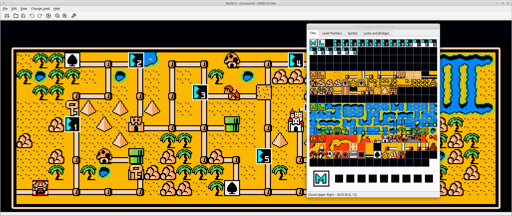
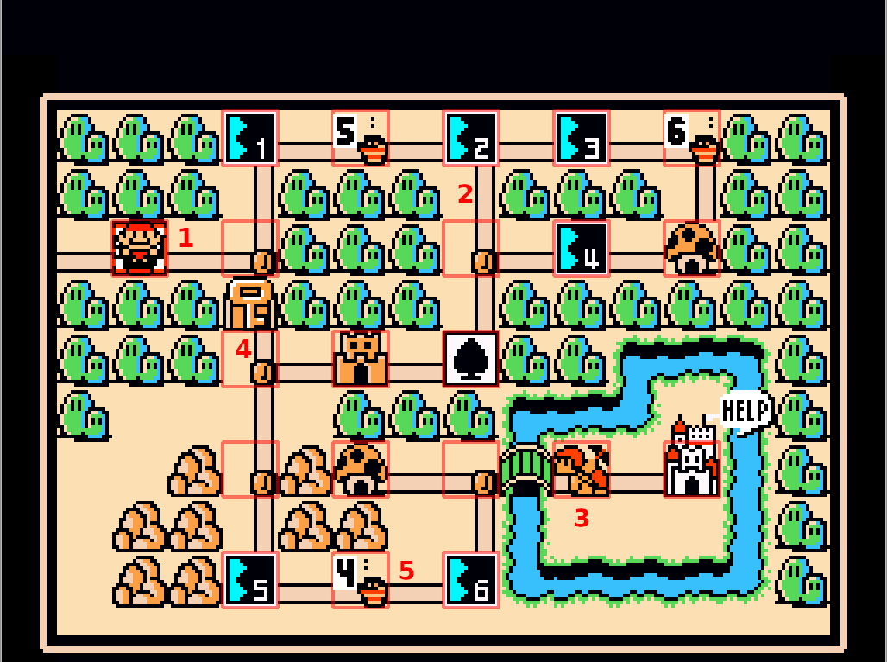
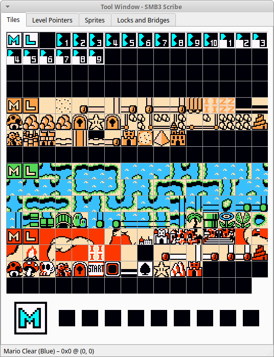
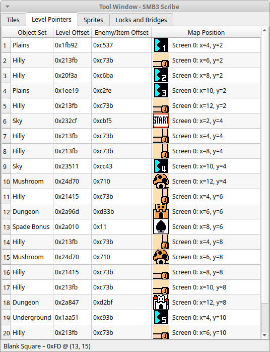
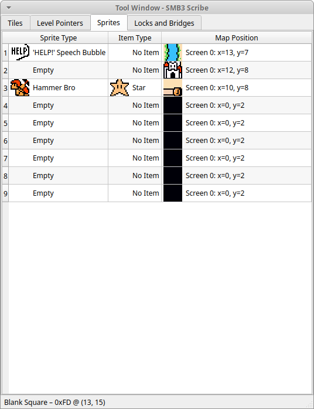
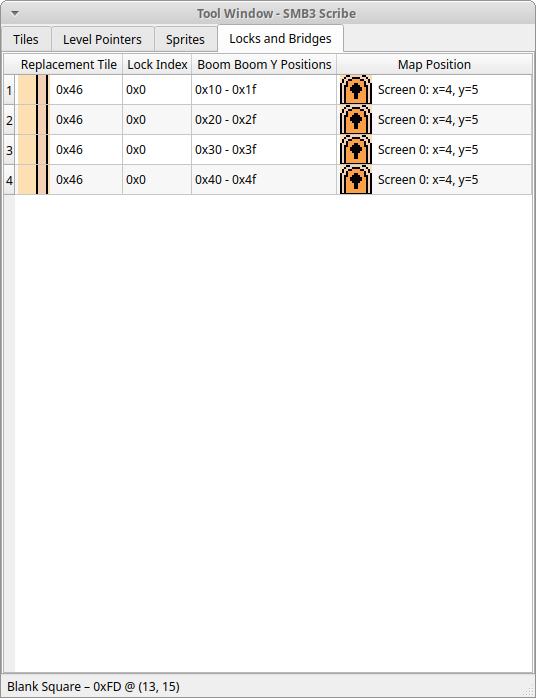
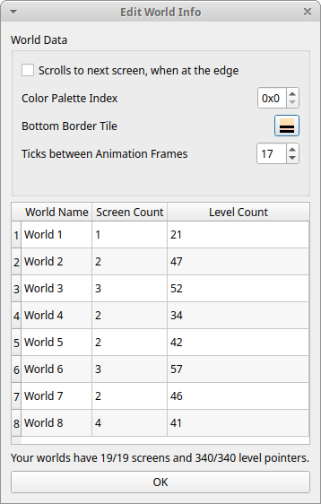

# SMB3 Scribe - Overworld Editor

## The World View

### Placing Tiles

In the Tool Window you will find a palette of all available Overworld Tiles. If enabled in the View Menu, they will even be
animated. This is important, since not all Tiles are fully animated and will thus not show up correctly in animated
World maps. Tile animation can be disabled in the World Info Dialog, however.

After clicking on a Tile in the Tool window, your cursor should change to show this tile and clicking or dragging the
cursor across the World View will "put" the tiles, where you want them.

### Selecting existing Tiles

You can also press the middle mouse button over a tile in the World View to select it and use it as you would from the
Tool Window.

### Filling/Replacing Tiles

If you have a Tile selected and Shift-Click onto a group of the same tile in the World View, those will be replaced by
the Tile you have selected currently. So if you, for example, selected a Tile with a Palm Tree on it and shift-clicked
on the Tile above Mario's Start Position, those 6 Bush Tiles would be replaced by Palm Trees.

### Highlighting multiple Tiles

If you hold the Ctrl Key, then left-click and drag the cursor over the World View, you can highlight multiple tiles and
copy them or move tham in a group as you would expect.

### 1 - Start Position

This is the Position in the Map you start out on, when you first come into the Overworld. It is shown as a Sprite of
Mario. You can change its y position by dragging Mario along the 2nd column, but you cannot change the x position of it,
since the game has it hard coded as being 2.

There is an .ips Patch, that lets you move the Start Position anywhere you want, but that is currently not supported.

You can toggle if Mario is being shown in the View Menu.

### 2 - Level Pointers

Levels are put on the World Map in the form of Level Pointers. They point to a specific address for the Objects and 
Enemies/Items of the Level in the Rom and the Object Set of the Rom. More on this in the Tool Window Section later.

You can move them freely around the Overworld. Some Tiles can be used to enter a Level, whenever you step on it, some 
others, like the one on the right of Mario, need a Sprite, so a Hammer Bro, or an Airship on them, to activate. That's
why there are Level Pointers on all "empty" spots in the Map.

You should also note, that Level Pointers in the 8th, so second to last, row are forbidden. This is, because when keeping
track of the completed levels, the game can only have 8 different row values, instead of the 9 it would need. So it was
decided, to not have any Levels on Row 8 and give that spot to Row 9 instead.

I'm not sure what happens, if you do put a Level there. It might just not get seen as completed, or the game crashes.

### 3 - Sprites

Sprites are things on the Overworld, that can move, unlike Tiles, which might be animated, but are stationary in terms of
their position.

You can place them freely on the map and sprites like Hammer Bros will follow any path they are put on at random, whenever
a level has been exited, by the player. More on this in the Tool Window Section later.

### 4 - Locks and Bridges

An overworld can define 4 different Effects, that happen, when a Fortress is cleared, or more specifically, when a Boom Boom
is killed and its Orb collected. More on this in the Tool Window Section later.

Since this is first used to "open" a Lock, I decided to represent them as Keys on the World View. The Lock in this case
is not actually opened, its tile is simply replaced by another of a straight path.

You can change which Tile should be replaced, by dragging the Key around.

### 5 - Airship Travel Points

Each Overworld can define 3 Paths with 6 points each along which an airship can travel. Which one of these is used, is
determined when you enter the world and is random, so if you really need the airship to travel a certain path, then just
have all 3 paths be the same.

In the View Menu, you can activate each Path by itself, to make it easier to drag the individual points across the map.
Those are marked with their number and a little dot next to it. Every dot is in a different Position, so you can see all
airship points, even if they are on top of each other. In the example above, Point 1 and 4 are at the bottom and Point 3
and 6 ar in the top right.

## Tool Window

### Tile Picker

The Tile Picker shows you all available Tiles you can use in the World Map. They will be colored based on the World
palette of the current world and, if enabled in the View Menu, the Tiles will be animated.

Notice that every 4 consecutive rows have the same 4 colors to choose from. Let's call that a sub palette. It will be
important later.

When clicking on a Tile, your cursor should change to that Tile, and it should be placed in the larger Tile Icon in the
bottom left Corner.

When choosing another, the previously selected Tile is pushed one space to the right, so that you have your most recent
Tiles always in reach.

You can hover over the Tiles and their name and tile index are shown in the Statusbar at the bottom of the Window.

### Level Pointer List

This table contains every Level Pointer currently in the World Map. They are listed in the order they are stored in the
Rom, which should usually also be the order by screen, then row, then column.

You can change the Object Set of each Pointer and the address of both the Objects (Level Offset) and the Enemies. The
Level information can be more comfortably set through Foundry, however, by opening the Level and placing it onto a Level
Pointer.

The position, along with the Tile at that position are only shown for informational purposes. You can change their
position, by enabling Level Pointers in the View Menu and simply dragging them around the Map.

If you want to add or remove Level Pointers, you can do that in the World Info Dialog.

### Sprite List

This tab lists all the Overworld Sprites. As you can see, there is a hard coded limit of 9 Sprites, although no world
actually uses that many.

You can change the Sprite Type by double-clicking on a cell. A Dropdown with all possible values will appear. Note that,
while the Hammer Bro Sprites look different depending on which kind of Hammer Bro it is, they should all look the same in
the actual game.

Akin to the Level Pointer List, you can not change the Map Position of a Sprite in this List, but you can enable them
in the View Menu and then simply drag them around.

Empty Sprites, meaning those entries without a Sprite Type set, will not be rendered in the World View and can those not
be moved around. So simply give it a Type first and move it then.

The Sprite Item is mostly relevant for the Hammer Bros and is what you get in the chest, after you beat them after
encountering them on a Map.

You will notice, that the second Sprite is Empty in all Vanilla worlds. That seems to be, because the Airship sprite is
placed there, once it shows up, so you should probably use up all the other spaces first, before going there.

### Locks and Bridges

Locks and Bridges describes the functionality of replacing a Tile on the World Map with another tile, when a BoomBoom is
defeated and its Orb collected. There are 17 entries, defining the Replacement Tile and the Map Position of the tile
to be replaced.

A World Map can choose 4 out of the 17, so at most 4 Tiles can be replaced by defeating 4 different BoomBooms.

The replacement tile should be obvious and double-clicking on it pops up a Tile Selector. Remember, however, that tiles
are grouped by their sub palette. When replacing a Tile using this mechanism here, it keeps the sub-palette of the one
it is replacing. Meaning replacing a horizontal path from the second group of tiles with a Level-10 Tile of the first
group of tiles, will make the Level-10 Tile look like it was made out of sand. Therefore, consider only replacing tiles
within the same sub-palette.

The Lock Index tells you which of the 17 Locks you are currently editing. In the Vanilla Game no Lock is reused, except
for the Lock with Index 0, which is what all unused entries are. It is only actually used in World 1.

There is nothing stopping you from reusing Locks in more than one World though. If the replacement works out in both
Worlds, go for it.

The Boom Boom position is just additional information. A BoomBoom needs to be put at that y position to result in the Lock
of that row to be popped. But in Foundry, selecting the Lock is done via the Level Settings, so there is no need to
remember this and to set the BoomBoom to a position in that range by hand.

## World Info

### World Data Settings

Just because a world consists of multiple screens, does not mean it needs to scroll between those. You could also
connect them via Pipe Pairs in Foundry and want to hide the fact, that there are multiple screens. That is achieved,
by disabling scrolling.

If you have a World with more than one screen, disable scrolling and still walk past the first screen, you'll find Mario
wrapping all the way around the screen and coming back onto the left of screen one. His movement and the Levels are based
on the second screen, but it is not shown at all. This can be used to make seemingly inaccessible areas in screen one
reachable, by building the path on the unseen second screen and disabling scroll causing Mario to wrap around.

Note that World 5 and World 8 are hard coded to not scroll. Enabling it, won't do anything, unfortunately.

The color palette index changes which sub palettes the Tiles use. There are 8 in total, basically one for each world.

The Bottom Border Tile can be set to anything you want. There is one, that is dependent on the world palette, which is
used for all but one World and one which is black, no matter what the world palette is, which is used for World 8 
exclusively. Might look goofy, when you use neither one, but you can use every Tile there is. 

The upper and side borders are always the same, however, and cannot be changed.

The ticks between Animation Frames determines how fast the animated Tiles should change through their Frames. The smaller
the value is, the faster they switch. A value of 0 deactivates Animation, which can be necessary to use certain Tiles
in your Map.

Note that World 5 and World 8 Screen 4 are hard coded to not have animations. This is represented in Scribe, where these
parts are also not animated, no matter the setting here, to stay true to the Rom.

### World Order and Size

In this list, you can change the Order of the current Worlds, by dragging them around or change their Screen and Level 
counts, by double-clicking them. There is a hard cap of 19 Screens (technically 20) and 340 Level Pointers (technically 350)
in total for the game. How those are distributed is up to you though. You could take some Worlds out by giving them 0 screens
and make the remaining ones all gigantic, for example.

The missing screen and Level Pointers belong to Warp World, which is also the only one whose position you can't change.
This is because a lot of code depends on it being where it is and having the Level Pointers that it has. The Level
Pointers actually don't really exist with an Object Address, Enemy Address etc. They are simply marked as "at this position"
and are then used to jump to different worlds. That's why it doesn't make sense to let that world be edited.

Note: Changing the position of the current world might be a bit buggy, with the GUI not knowing you did it, but internally
everything is taken care off and will be saved just fine.

## Editor Settings

### GUI Settings

The default path option lets you choose where the Editor starts off when opening, or saving a Rom. Normally it would
open, from a folder in your temp directory, since that is where the editor lives, when you open it (technical detail),
but by setting this to either one of the predefined options, or by clicking the folder button and navigating to your Roms
folder, for example, you don't have to search it out everytime you open the editor.

### Emulator Settings

To be able to use Instaplay to try your World Maps right out of the Editor, you will need to set either a command, as shown
here, that you would use on the commandline to open your emulator, or a path by clicking the folder button and searching
for the executable of your emulator of choice.

Scribe is using the command line to open the emulator, so in the second textbox you can set any command line parameters
you like. If you don't know what that means, either check the manual of your emulator or just leave it as it is.

The %f will be replaced with a path to the temporary Rom the Instaplay feature creates and your emulator is hopefully
smart enough to just open any file it's given.
